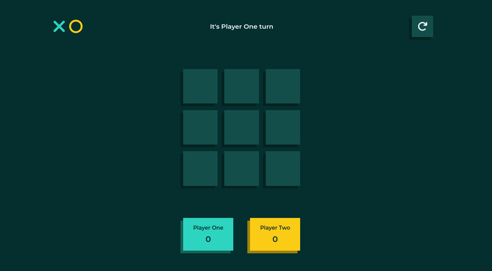

# Tic-Tac-Toe Game

Welcome to the Tic-Tac-Toe game repository! This is a simple JavaScript implementation of the classic tic-tac-toe game that you can play in your browser.

## Goal

The main goal was to have as little global code as possible and practice preventing pollution of root scope, tucking everything inside a module or factory.

## Demo

Check out the live demo of the Tic-Tac-Toe game [here](https://sofiabaezzato.github.io/tic-tac-toe/).

## Features

- Play against a friend locally
- Responsive design for various screen sizes
- Interactive user interface
- Keeps track of the players' points
- Restart game button

